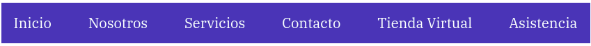
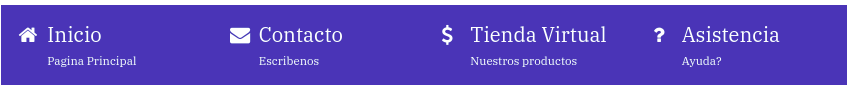

# Menus de navegación con Flexbox

## html



```html
<nav class="nav">
  <ul class="menu-sencillo">
    <li class="menu-sencillo__item"><a href="#">Inicio</a></li>
    <li class="menu-sencillo__item"><a href="#">Nosotros</a></li>
    <li class="menu-sencillo__item"><a href="#">Servicios</a></li>
    <li class="menu-sencillo__item"><a href="#">Contacto</a></li>
    <li class="menu-sencillo__item"><a href="#">Tienda Virtual</a></li>
    <li class="menu-sencillo__item"><a href="#">Asistencia</a></li>
  </ul>
</nav>
```

## css

```css
.menu-sencillo {
  display: flex;
  flex-direction: column;
}
.menu-sencillo .menu-sencillo__item {
  text-align: center;
  margin-bottom: 0.5rem;
}
.menu-sencillo .menu-sencillo__item:last-of-type {
  margin-bottom: 0;
}

@media (min-width: 768px) {
  .menu-sencillo {
    display: flex;
    flex-flow: row wrap;
    justify-content: space-between;
  }
  .menu-sencillo .menu-sencillo__item {
    margin-bottom: 0;
  }
}
```



```html
<nav class="nav">
  <ul class="menu-iconos">
    <li>
      <a href="#" class="menu-iconos__link">
        <div class="menu-iconos__icono">
          <i class="fa fa-home" aria-hidden="true"></i>
        </div>
        <div class="menu-iconos__texto">
          Inicio
          <span>Pagina Principal</span>
        </div>
      </a>
    </li>
    <li>
      <a href="#" class="menu-iconos__link">
        <div class="menu-iconos__icono">
          <i class="fa fa-envelope" aria-hidden="true"></i>
        </div>
        <div class="menu-iconos__texto">
          Contacto
          <span>Escribenos</span>
        </div>
      </a>
    </li>
    <li>
      <a href="" class="menu-iconos__link">
        <div class="menu-iconos__icono">
          <i class="fa fa-usd" aria-hidden="true"></i>
        </div>
        <div class="menu-iconos__texto">
          Tienda Virtual
          <span>Nuestros productos</span>
        </div>
      </a>
    </li>
    <li>
      <a href="" class="menu-iconos__link">
        <div class="menu-iconos__icono">
          <i class="fa fa-question" aria-hidden="true"></i>
        </div>
        <div class="menu-iconos__texto">
          Asistencia
          <span>Ayuda?</span>
        </div>
      </a>
    </li>
  </ul>
</nav>
```

## css

```css
.menu-iconos {
  display: flex;
  flex-direction: column;
}

.menu-iconos__link {
  display: flex;
}
.menu-iconos__icono {
  flex: 0 1 2rem;
}
.menu-iconos__texto {
  display: flex;
  flex-direction: column;
}
.menu-iconos__texto span {
  display: block;
  font-size: 0.8rem;
  margin-top: 0.5rem;
}

@media (min-width: 480px) {
  .menu-iconos {
    flex-flow: row wrap;
  }
  .menu-iconos li {
    flex: 0 1 50%;
  }
}
@media (min-width: 768px) {
  .menu-iconos li {
    flex: 1;
  }
}
```
